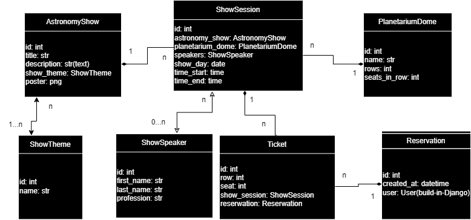

# Planetarium
Planetarium API IService

This API provides ease and clear way to handle of planetarium working.

## Table of Contents
- [Diagram](#diagram)
- [Features](#features)
- [Installation](#installation)
- [License](#license)
- [Running Tests](#running-tests)
- [Contact Information](#contact-information)

## Diagram
This API described by this diagram:

## Features
- Creation and handling of planetarium domes, astronomy shows, show sessions, tickets.
- Validation tickets and working time of show speakers.

## Installation

To start project locally:
- You need to have installed Docker Desktop
- Clone the repository: https://github.com/VladyslavBazhyn/Planetarium
- python -m venv venv
- On Windows: venv/Scripts/activate / On macOS or Linux: source venv/bin/activate
- Create .env according to .env.example
- docker-compose up --build

## License

All conditions for using this API [here](https://github.com/VladyslavBazhyn/Planetarium/blob/main/LICENSE)

## Running Tests

For running test:
- docker-compose exec planetarium sh    
- python manage.py test

## Contact Information

This project made by https://github.com/VladyslavBazhyn/
My mail: mr.darmstadtium@gmail.com
My telegram: https://t.me/MrDarmstadtium

### Prerequisites
- Python 3.x
- Docker
- Docker Compose
